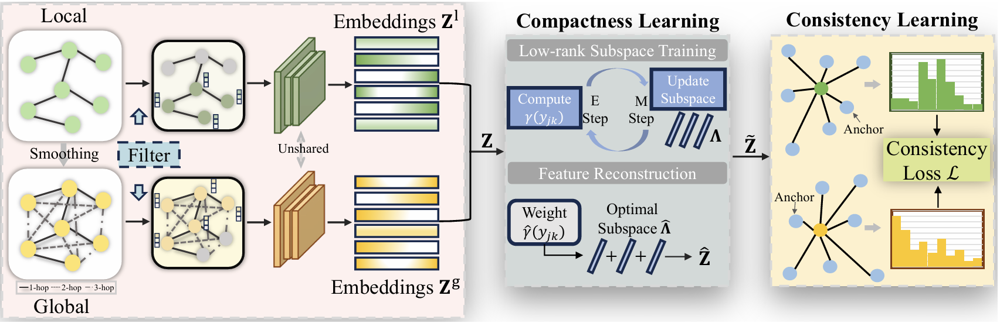

<div align="center">
  <h1>CoCo: Compactness and Consistency for Deep Graph Clustering</h1>
  <p align="center">
    <strong>A Deep Graph Clustering Framework.</strong>
  </p>
  <p align="center" style="font-size: 0; line-height: 0;">
    <a href="https://openreview.net/pdf?id=9jdQLmPUHW" style="text-decoration: none; display: inline-block; margin: 0 2px;">
      
    </a><a href="https://github.com/juweipku/CoCo" style="text-decoration: none; display: inline-block; margin: 0 2px;">
      
    </a><a href="https://iclr.cc/Conferences/2026" style="text-decoration: none; display: inline-block; margin: 0 2px;">
      
    </a>
  </p>
</div>

This is the pytorch implementation for our ICLR 2026 Oral:
> Wei Ju, Siyu Yi, Kangjie Zheng, Yifan Wang, Ziyue Qiao, Li Shen, Yongdao Zhou, Xiaochun Cao, Jiancheng Lv. 
> Compactness and Consistency: A Conjoint Framework for Deep Graph Clustering. ICLR 2026 Oral 

---

## 🛠️Overview



CoCo is a deep graph clustering framework designed to learn **compact** and **semantically consistent** node representations from graph data. The method addresses two core issues in existing graph clustering methods:

- limited ability of local message passing to capture long-range dependencies;
- redundancy and noise in graph data that harm representation quality.

To solve this, CoCo combines:

1. **Local-view and global-view feature extraction** using graph convolutional filters on the original graph and a graph diffusion graph;
2. **Compactness learning** via GMM-based low-rank subspace training and feature reconstruction;
3. **Consistency learning** by aligning node-wise similarity distributions across the two views.

After training, the local and global compact embeddings are fused and K-means is applied to obtain final clustering assignments.

---

## 🚀 Quickstart

### 1.Environment

The paper implementation is based on **PyTorch**.

```bash
conda create -n coco python=3.10 -y
conda activate coco
pip install -r requirements.txt
```

---

### 2.Dataset preparation

The main graph clustering experiments use the following [datasets](https://github.com/yueliu1999/Awesome-Deep-Graph-Clustering#datasets-details):

- Cora
- AMAP
- BAT
- EAT
- UAT

Data layout:

```text
dataset/<dataset>/
├── <dataset>_feat.npy
├── <dataset>_label.npy
└── <dataset>_adj.npy
```

---

### 3.RUN

**Main clustering experiments**

```bash
python train.py --dataset cora 
```

Dataset configuration could be found in `setup.py`.

The reported metrics are:

- **ACC**: clustering accuracy
- **NMI**: normalized mutual information
- **ARI**: adjusted rand index
- **F1**: macro F1-score

For reproducibility, report the **mean ± standard deviation over 10 runs**.

---

## 📈Main results

**Graph clustering**

| Dataset |   ACC |   NMI |   ARI |    F1 |
| ------- | ----: | ----: | ----: | ----: |
| Cora    | 79.36 | 60.71 | 58.76 | 77.95 |
| AMAP    | 79.27 | 68.85 | 60.94 | 72.36 |
| BAT     | 78.85 | 55.00 | 53.52 | 78.56 |
| EAT     | 58.87 | 34.10 | 27.91 | 58.06 |
| UAT     | 59.68 | 30.12 | 29.46 | 58.03 |

---

## 📝Citation

If you find this work useful, please cite:

```bibtex
@inproceedings{ju2026compactness,
  title={Compactness and Consistency: A Conjoint Framework for Deep Graph Clustering},
  author={Ju, Wei and Yi, Siyu and Zheng, Kangjie and Wang, Yifan and Qiao, Ziyue and Shen, Li and Zhou, Yongdao and Cao, Xiaochun and Lv, Jiancheng},
  booktitle={The Fourteenth International Conference on Learning Representations},
  year={2026}
}
```

---

## 🙏Acknowledgment

This repository utilizes the pre-processed datasets provided by the following sources. We gratefully acknowledge the authors and contributors for their valuable work and open sharing:

+ [yueliu1999/Awesome-Deep-Graph-Clustering](https://github.com/yueliu1999/Awesome-Deep-Graph-Clustering)

